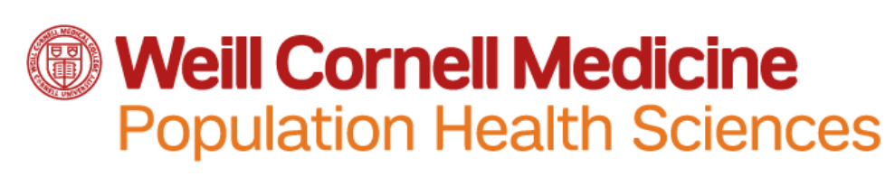
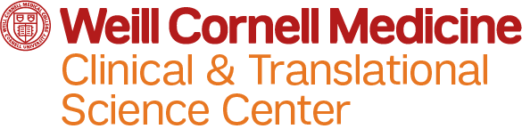

 

 

The Weill Cornell Medicine Biostatistics Computing Club serves as a forum for academic research staff and faculty to learn new computational skills, specifically regarding Biostatistical analyses. The goals of the club are: to bridge the skills gap that exists amongst researchers siloed in their own lines of work, to foster cross-institutional collaboration, and to help members grow personally and professionally with the computational skills they wish to master. We hold informal, interactive meetings approximately once a month.

The club was founded in 2018 by [Jihui Lee](https://jihuilee.com) and [Elizabeth Mauer](https://twitter.com/liz_mauer), and it is currently run by [Katherine Hoffman](https://www.khstats.com) and [Anjile An](https://phs.weill.cornell.edu/directory/profiles/anjile). The club is hosted by the [Division of Biostatistics](http://hpr.weill.cornell.edu/divisions/biostatistics/), [Department of Population Health Sciences](https://phs.weill.cornell.edu) along with the [Biostatistics, Epidemiology and Research Design (BERD) Core](https://ctscweb.weill.cornell.edu/about-us/ctsc-programs/biostatistics-epidemiology-and-research-design), [Clinical and Translational Science Center](https://ctscweb.weill.cornell.edu/).

<!-- ### WCM Data Science Club (WCM-DSC) -->

<!-- We are a community of data scientists in the Tri-Institutional system. The aim of this club is to provide a support system to all the students who are looking to build their skillset in data science. Club activities include regular meetings where students share their data science projects and guest speaker events where experienced data scientists from the industry as well as research institutions present on a variety of topics. We encourage students for all experience levels to attend the events. -->

<!-- Sign up for our listserv [here](https://docs.google.com/forms/d/e/1FAIpQLSfxNuEVslSp_RrjsTq58fJn9axRQhWpmz6bC-XGDr8tDuQagg/viewform). -->

<!-- Follow us on Twitter!  -->
